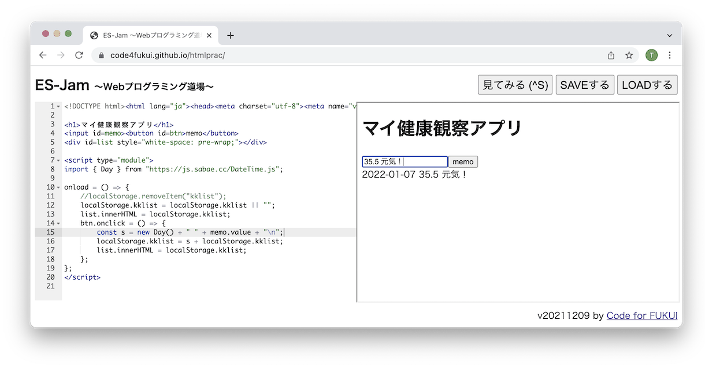

# mykkrec (マイ健康観察アプリ)

毎日の健康観察を記録するためのシンプルなシングルページWebアプリです。ブラウザ上のみで動作し、すべてのデータを`localStorage`に保存します。

## デモ

アプリの動作確認はこちら: [https://code4fukui.github.io/mykkrec/](https://code4fukui.github.io/mykkrec/)

## 機能

- **サーバーレス:** ビルド不要で、単一のHTMLファイルとしてブラウザ上のみで動作します。
- **永続的な保存:** すべてのメモをブラウザの`localStorage`に直接保存します。
- **シンプルなインターフェース:** メモを入力してボタンをクリックするだけで、現在の日付とともに保存されます。
- **時系列ログ:** 新しいエントリはリストの一番上に追加され、簡単に確認できます。
- **モバイルフレンドリー:** レスポンシブデザインとカスタムの`apple-touch-icon`（健康を意味する「健」の漢字）を備えています。

## 使い方

1. ブラウザで[デモURL](https://code4fukui.github.io/mykkrec/)を開きます。
2. テキストフィールドに健康状態のメモを入力します。
3. 「memo」ボタンをクリックしてエントリを保存します。
4. 新しいエントリが現在の日付のタイムスタンプとともにリストの一番上に表示されます。

## 仕組み

- **データ保存:** すべてのエントリは1つの文字列に結合され、ブラウザの`localStorage`に`kklist`というキーで保存されます。
- **日付スタンプ:** [DateTime.js](https://js.sabae.cc/DateTime.js)の`Day`クラスを使用して、各新規エントリの先頭に現在の日付を追加します。

## ライセンス

このプロジェクトはMIT Licenseの下で利用可能です。
